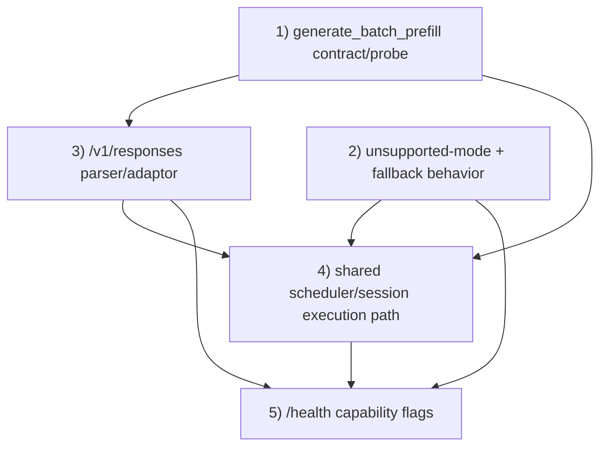

# Batch Prefill And Session-State Compatibility Goal

## Scope

Complete the compatibility scaffolding needed to move OpenAI-style batch jobs,
`/v1/responses` batch inputs, and server prefill batching toward one shared
scheduler/session execution path.

This goal tracks the active subset of:

- `docs/plans/priority-microbatching-scheduler.md`
- `docs/plans/multi-model-session-state-serving.md`

It does not claim full runtime multi-request batching, multi-resident model
serving, decode batching, MTP/DFlash verify batching, or disk state-cache
spill/reload.

## Current Progress

| Goal | Status | Evidence | Remaining work |
|---|---|---|---|
| 1) `generate_batch_prefill` contract/probe | PARTIAL | `cli/generate_batch_prefill_protocol.ts`, `cli/generate_batch_prefill_protocol.test.ts`, scaffold contract section in `docs/plans/multi-model-session-state-serving.md` | Add stronger validation helpers for batch/session envelopes before scheduler insertion; daemon still only reports unsupported/missing capability. |
| 2) Unsupported-mode + fallback behavior | PARTIAL | `cli/batch_api.ts`, `cli/index.ts`, `cli/prefill_batch_health.ts`, batch validation tests | Fallback propagation exists, but mixed-mode execution policy and lifecycle transitions still need endpoint-level integration tests and a single normalized reason enum across validation/runtime paths. |
| 3) `/v1/responses` parser/adaptor | PARTIAL | `normalizeResponsesBatchInputBody` in `cli/batch_api.ts`, `parseResponsesToChatBody` in `cli/index.ts`, `cli/batch_api.test.ts` | Batch normalization exists for text/message inputs, but output conversion and request-shape coverage need endpoint tests; richer Responses content/tool forms remain rejected by policy. |
| 4) Shared scheduler/session execution path | PARTIAL | `cli/worker_scheduler.ts`, `cli/session_state.ts`, `cli/server_prefill_batch.ts`, `cli/index.ts` | CLI creates session drafts and uses scheduler preview/selection, but real execution remains serialized/placeholder because daemon lacks per-session state handles and `generate_batch_prefill` dispatch. |
| 5) `/health` response capability flags | PARTIAL | `cli/prefill_batch_health.ts`, `/health` block in `cli/index.ts`, `cli/prefill_batch_health.test.ts` | Health exposes capability/fallback counters, but state-cache telemetry and end-to-end runtime transition coverage are still incomplete. |

## What Is Still Incomplete In The Plan Docs

### `docs/plans/priority-microbatching-scheduler.md`

Still incomplete or blocked:

- True prefill microbatching: same-worker AR text suffixes are selected by
  scheduler scaffolding, but not dispatched to a real daemon batched prefill
  implementation.
- Runtime `generate_batch_prefill`: daemon-side session-batched execution is
  not implemented; current probe can only classify `unknown`, `unsupported`, or
  future `supported`.
- Prefix/state cache runtime hookup: manifest compatibility and spill guardrails
  exist, but cache hit/miss/spill/rehydrate are not wired through daemon state.
- Priority/fairness hardening beyond current queue selection: starvation
  prevention, deadline aging, deeper backpressure tests, and mixed-priority
  latency tests remain follow-up.
- Decode batching remains unimplemented.
- MTP/DFlash verify batching remains unimplemented.
- State-cache disk spill/reload remains unimplemented.

### `docs/plans/multi-model-session-state-serving.md`

Still incomplete or blocked:

- Multi-model worker residency: serve still effectively routes through one
  currently loaded model; a resident `ModelRegistry`/worker pool is not present.
- Runtime `RequestSession` ownership: CLI has session drafts, but daemon/model
  state still needs real per-session ownership for `seq_pos`, token history,
  KV, DeltaNet, Mamba, scratch/logits, and stream state.
- Per-session state arena: attention, recurrent, and architecture-specific
  state handles are described and represented in metadata only; runtime arenas
  are not implemented.
- Runtime prefix cache: fingerprint/manifests exist, but there is no integrated
  cache index that attaches complete sequence-state checkpoints to request
  execution.
- Same-model prefill batching: eligibility and scheduler metadata exist, but
  daemon hot path still lacks per-session batched prefill execution.
- State cache spill/touch telemetry: guardrails exist, but end-to-end request
  loop telemetry is incomplete.

## Dependency Graph

## Completion Evidence Needed

- Contract tests prove valid `/v1/responses` batch payloads become scheduler
  sessions with stable IDs.
- Unsupported-mode tests prove deterministic rejection/fallback reason
  propagation and telemetry counting.
- Mixed-mode batch tests prove invalid lines are rejected while valid lines keep
  stable output/error correlation according to policy.
- Execution-path tests prove one scheduler/session path drives
  `queued -> in_progress -> completed/failed/cancelled` transitions.
- Health tests prove `/health` reflects capability flags, selected execution
  mode, fallback reasons, unsupported-mode counters, and state-cache telemetry.
